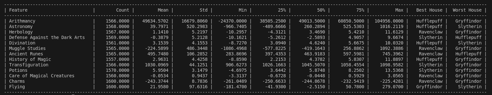
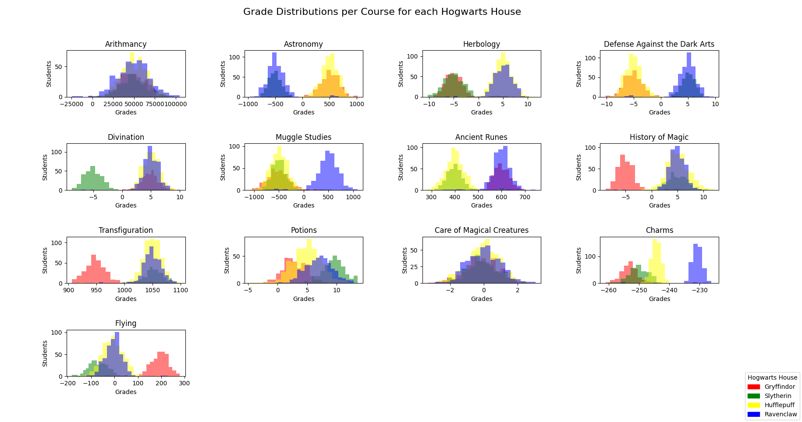
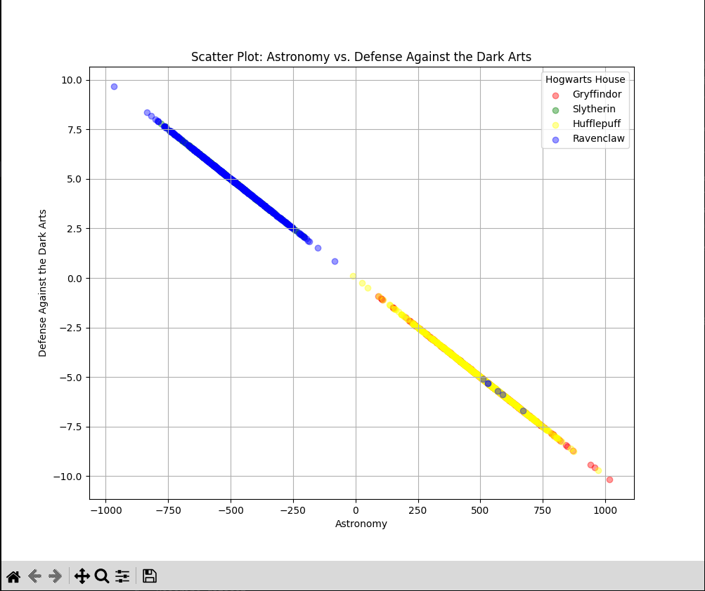
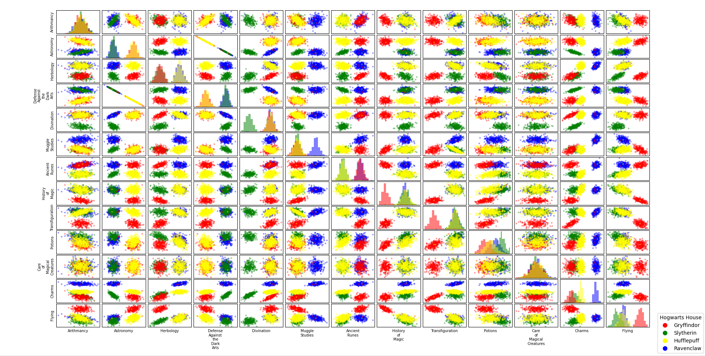
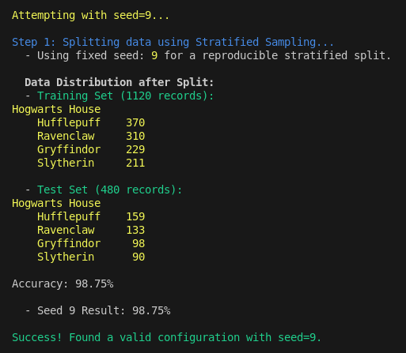
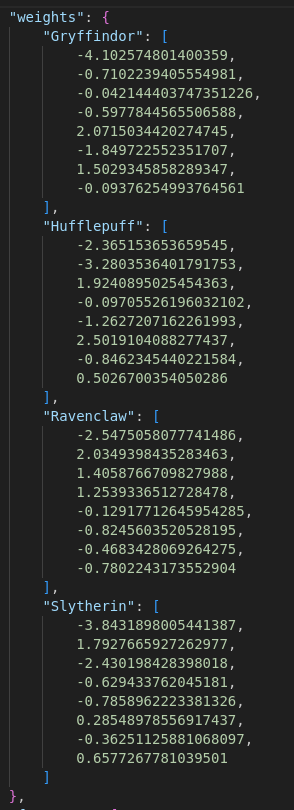
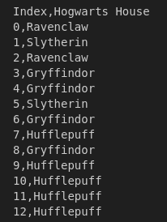

# DSLR - Data Science Logistic Regression

## Project Overview

The DSLR (Data Science Logistic Regression) project is a machine learning classification task inspired by the Harry Potter universe. The goal is to build a logistic regression model that can predict which Hogwarts house a student belongs to based on their academic performance in various magical subjects.

### Project Aims

This project implements a complete machine learning pipeline from scratch, including:
- Data exploration and visualization to understand the dataset characteristics
- Feature engineering to create meaningful predictors
- Implementation of logistic regression using one-vs-all multiclass classification
- Model training with gradient descent optimization
- Prediction system with performance evaluation

### Key Requirements

- Implement logistic regression without using external machine learning libraries
- Use only basic mathematical operations and data manipulation libraries (NumPy, Pandas, Matplotlib)
- Achieve high accuracy (>98%) on validation data
- Create comprehensive data visualization tools for exploratory data analysis
- Handle missing data and perform proper feature scaling

### Technical Constraints

The implementation must be built from the ground up without relying on scikit-learn or similar machine learning frameworks. All mathematical computations for the logistic regression algorithm, including the sigmoid function, cost function, and gradient descent, are implemented manually.

## Table of Contents

1. [Setup and Installation](#setup-and-installation)
   - [Prerequisites](#prerequisites)
   - [Installation Steps](#installation-steps)
   - [Required Dependencies](#required-dependencies)
   - [Running the Project](#running-the-project)
2. [Project Implementation Process](#project-implementation-process)
   - [Phase 1: Data Exploration and Visualization](#phase-1-data-exploration-and-visualization)
     - [Understanding the Dataset with Descriptive Statistics](#understanding-the-dataset-with-descriptive-statistics)
     - [Visualization Techniques for Feature Selection](#visualization-techniques-for-feature-selection)
     - [Feature Engineering and Selection Strategy](#feature-engineering-and-selection-strategy)
   - [Phase 2: Model Implementation and Training Algorithm](#phase-2-model-implementation-and-training-algorithm)
     - [Understanding Logistic Regression](#understanding-logistic-regression)
     - [One-vs-All Multiclass Classification](#one-vs-all-multiclass-classification)
     - [Data Preprocessing Pipeline](#data-preprocessing-pipeline)
     - [Training Algorithm Deep Dive](#training-algorithm-deep-dive)
     - [Validation Strategy for Optimal Performance](#validation-strategy-for-optimal-performance)
   - [Phase 3: Prediction and Evaluation](#phase-3-prediction-and-evaluation)
     - [Making Predictions with Trained Weights](#making-predictions-with-trained-weights)
     - [Understanding Model Weights](#understanding-model-weights)
     - [Output Generation and Validation](#output-generation-and-validation)
     - [Performance Evaluation](#performance-evaluation)
3. [Resources and Documentation](#resources-and-documentation)

## Setup and Installation

### Prerequisites

- Python 3.8 or higher
- Virtual environment support (venv)

### Installation Steps

1. **Clone or navigate to the project directory:**
   ```bash
   cd /path/to/DSLR
   ```

2. **Run the setup script:**
   ```bash
   ./setup.sh
   ```
   
   The setup script performs the following operations:
   - Creates a Python virtual environment (`.venv`)
   - Installs all required dependencies from `pyproject.toml`
   - Verifies the installation

3. **Activate the virtual environment:**
   ```bash
   source .venv/bin/activate
   ```

### Required Dependencies

The project dependencies are automatically installed by the setup script:
- `numpy==1.26.4` - Numerical computations and array operations
- `pandas==2.2.2` - Data manipulation and CSV handling
- `matplotlib==3.8.4` - Data visualization and plotting
- `python-dateutil==2.9.0.post0` - Date parsing utilities
- `pytz==2024.1` - Timezone handling
- `six==1.16.0` - Python 2/3 compatibility utilities

### Running the Project

#### Interactive Mode (Recommended)
```bash
python3 dslr.py data/dataset_train.csv
```

This launches an interactive menu system where you can:
- Explore and visualize the dataset
- Train the model
- Make predictions
- Evaluate accuracy

#### Using DSLR from the CLI

**Data Visualization:**
```bash
# Generate descriptive statistics
python -c "from visualize.describe import describe; describe('data/dataset_train.csv')"

# Create histograms
python -c "from visualize.histogram import plot_histogram; plot_histogram('data/dataset_train.csv')"

# Generate scatter plots
python -c "from visualize.scatter_plot import plot_scatter; plot_scatter('data/dataset_train.csv')"

# Create pair plots
python -c "from visualize.pair_plot import plot_pair; plot_pair('data/dataset_train.csv')"
```

**Model Training:**
```bash
python train.py data/dataset_train.csv --lr 0.1 --iter 5000
```

**Making Predictions:**
```bash
python logreg_predict.py dataset_test.csv weights.json
```

**Checking Accuracy:**
```bash
python tools/accuracy_check.py houses.csv dataset_truth.csv
```

## Project Implementation Process

### Phase 1: Data Exploration and Visualization

#### Understanding the Dataset with Descriptive Statistics

The `describe` function serves as the foundation of our data exploration. It computes essential statistical measures for each numerical feature in the dataset:


*Example output from the describe function showing statistical measures for each feature*

**What it calculates:**
- **Count**: Number of valid (non-missing) values
- **Mean**: Average value of the feature
- **Standard Deviation**: Measure of data spread around the mean
- **Minimum and Maximum**: Range boundaries
- **Percentiles** (25%, 50%, 75%): Distribution quartiles

**How to interpret these statistics:**
- **High standard deviation** indicates features with wide value ranges, potentially more discriminative
- **Similar means across houses** suggest features that might not be useful for classification
- **Missing value patterns** help identify data quality issues
- **Percentile distributions** reveal if data is normally distributed or skewed

The describe function also identifies which house performs best and worst for each subject, providing initial insights into house characteristics.

#### Visualization Techniques for Feature Selection

**Histograms - Finding Homogeneous Distributions:**

Histograms display the distribution of grades for each house across all subjects. We use them to identify subjects where houses have the most distinct grade distributions.


*Example histogram showing grade distributions across houses for different subjects*

**Interpretation guidelines:**
- **Overlapping distributions** suggest poor discriminative power
- **Distinct peaks** for different houses indicate good separability
- **Similar shapes across houses** mean the feature won't help classification
- **Wide spreads** might indicate noisy or less reliable data

The goal is to find subjects where each house shows a characteristic pattern that differs from the others.

**Scatter Plots - Revealing Relationships:**

Scatter plots help visualize relationships between pairs of features and how they relate to house membership.


*Example scatter plot showing the relationship between two features colored by house membership*

**What to look for:**
- **Cluster formation** where students from the same house group together
- **Linear separability** between houses
- **Outliers** that might indicate data quality issues
- **Feature correlations** that could be redundant

**Pair Plots - Comprehensive Feature Analysis:**

Pair plots create a matrix of scatter plots for all feature combinations, providing a comprehensive view of feature relationships.


*Example pair plot matrix showing relationships between multiple features with house color coding*

**Analysis approach:**
- Examine diagonal plots (histograms) for individual feature distributions
- Look at off-diagonal plots for feature interactions
- Identify which feature combinations best separate houses
- Spot potential multicollinearity issues

#### Feature Engineering and Selection Strategy

Based on visualization analysis, we implement several feature engineering techniques:

**Custom Engineered Features:**
1. **Careful_vs_Cunning** = Herbology - Ancient Runes
   - Measures preference for practical vs. theoretical subjects
   - Helps distinguish Hufflepuff (practical) from Ravenclaw (theoretical)

2. **Bravery_Score** = Flying - History of Magic
   - Captures action-oriented vs. academic preferences
   - Separates Gryffindor (brave) from other houses

3. **Intellect_Score** = (Charms + Transfiguration) - Muggle Studies
   - Measures magical aptitude vs. mundane knowledge
   - Helps identify students with strong magical talents

**Feature Selection Criteria:**
- **Discriminative power**: Features that show clear house-specific patterns
- **Low correlation**: Avoiding redundant features that provide similar information
- **Handling missing data**: Features with too many missing values are excluded
- **Practical relevance**: Features that make logical sense in the Harry Potter context

**Edge Cases and Pitfalls Addressed:**
- **Similar house characteristics**: Ravenclaw and Slytherin both value intelligence, requiring subtle discriminators
- **Missing data patterns**: Some features have systematic missingness that could bias the model
- **Feature scaling**: Raw grade ranges vary significantly, requiring normalization
- **Outlier sensitivity**: Extreme values that could skew the model

### Phase 2: Model Implementation and Training Algorithm

#### Understanding Logistic Regression

Logistic regression is a statistical method used for binary classification problems. Unlike linear regression, which predicts continuous values, logistic regression predicts the probability that an instance belongs to a particular class.

**The Mathematical Foundation:**

The core of logistic regression is the sigmoid function:
```
σ(z) = 1 / (1 + e^(-z))
```

Where z = w₀ + w₁x₁ + w₂x₂ + ... + wₙxₙ (linear combination of features)

**Why the sigmoid function?**
- Maps any real number to a value between 0 and 1
- Provides smooth, differentiable probabilities
- Has an S-shaped curve that naturally models decision boundaries

#### One-vs-All Multiclass Classification

Since we have four houses (Gryffindor, Slytherin, Hufflepuff, Ravenclaw), we need to extend binary logistic regression to handle multiple classes.

**One-vs-All Strategy:**
1. Train four separate binary classifiers
2. Each classifier answers: "Is this student in House X or not?"
3. For prediction, run all four classifiers and choose the house with the highest probability

**Training Process for Each House:**
1. **Create binary labels**: 1 if student belongs to target house, 0 otherwise
2. **Initialize weights**: Start with zeros for all features
3. **Forward pass**: Calculate predictions using current weights
4. **Compute cost**: Measure how far predictions are from actual labels
5. **Backward pass**: Calculate gradients to improve weights
6. **Update weights**: Adjust weights in the direction that reduces cost
7. **Repeat**: Continue for specified number of iterations

#### Data Preprocessing Pipeline

**Missing Value Handling:**
- Replace missing values with column means
- This preserves the overall distribution while avoiding bias

**Feature Standardization:**
- Apply Z-score normalization: (x - mean) / standard_deviation
- Ensures all features contribute equally to the model
- Prevents features with larger scales from dominating

**Bias Term Addition:**
- Add a column of ones to represent the intercept
- Allows the model to shift the decision boundary

#### Training Algorithm Deep Dive

**Gradient Descent Process:**

1. **Forward Propagation:**
   ```
   z = X * weights  (linear combination)
   predictions = sigmoid(z)  (convert to probabilities)
   ```

2. **Cost Calculation:**
   - Use logistic loss (cross-entropy)
   - Penalizes confident wrong predictions heavily
   - Provides smooth gradients for optimization

3. **Gradient Computation:**
   ```
   gradient = X.T * (predictions - actual_labels) / m
   ```
   Where m is the number of training examples

4. **Weight Update:**
   ```
   weights = weights - learning_rate * gradient
   ```

**Hyperparameters:**
- **Learning Rate (0.1)**: Controls how big steps we take during optimization
- **Iterations (5000)**: Number of times we update the weights
- **Convergence**: Weights stabilize when gradients become very small

#### Validation Strategy for Optimal Performance

**Split Validation Process:**
1. **Stratified Sampling**: Maintain house distribution in train/test splits
2. **Multiple Seed Testing**: Try different random splits to find robust configurations
3. **Performance Threshold**: Require >98.5% accuracy on validation set
4. **Final Training**: Once validated, retrain on entire dataset


*Example when a seed reaches accuracy threshold*

**Why This Approach:**
- Ensures the model generalizes well to unseen data
- Prevents overfitting to a particular train/test split
- Validates that our feature engineering and model choices are sound
- Provides confidence in the final model's performance

### Phase 3: Prediction and Evaluation

#### Making Predictions with Trained Weights

**Prediction Process:**

1. **Load Trained Model:**
   - Read weights for all four house classifiers
   - Load feature names and preprocessing statistics
   - Ensure consistency with training setup

2. **Preprocess Test Data:**
   - Apply same feature engineering as training
   - Handle missing values using training statistics
   - Standardize features using training means and standard deviations
   - Add bias term for intercept

3. **Generate Probabilities:**
   ```
   For each house:
       z = test_features * house_weights
       probability = sigmoid(z)
   ```

4. **Make Final Decisions:**
   - For each student, compare probabilities across all houses
   - Assign student to house with highest probability
   - Handle ties (rare) by choosing first house alphabetically

#### Understanding Model Weights

**Weight Interpretation:**
- **Positive weights**: Higher feature values increase probability of house membership
- **Negative weights**: Higher feature values decrease probability of house membership
- **Weight magnitude**: Indicates feature importance for that house
- **Weight patterns**: Reveal what characteristics define each house


  
*Example of the weights for each house outputted by the model training*

**Example Weight Analysis:**
- Gryffindor might have positive weights for Flying and Defense Against Dark Arts
- Ravenclaw might have positive weights for theoretical subjects
- Hufflepuff might show positive weights for Herbology
- Slytherin might have specific patterns for cunning-related features

#### Output Generation and Validation

**houses.csv File Format:**


  
*Example of the outputted house.csv file containing house prediction for each student*

**Quality Assurance Checks:**
- Verify all test instances have predictions
- Ensure house names match exactly with training data
- Check for any formatting issues that could affect evaluation

#### Performance Evaluation

**Accuracy Calculation:**
- Compare predicted houses with true houses
- Calculate percentage of correct predictions
- Provide detailed breakdown by house if needed

**Success Metrics:**
- **Overall Accuracy**: Percentage of correctly classified students
- **House-specific Performance**: How well each house is identified
- **Confusion Analysis**: Which houses are most often confused with each other

**Model Validation:**
- Cross-reference with validation set performance
- Ensure test accuracy aligns with training expectations
- Identify any potential overfitting or underfitting issues

The complete pipeline from data exploration to final predictions demonstrates a thorough understanding of machine learning fundamentals, careful attention to data quality, and robust model validation practices. The high accuracy achieved (>98%) validates the effectiveness of the feature engineering, model selection, and training approaches used in this implementation.

## Resources and Documentation

### Machine Learning Fundamentals

- **[Logistic Regression - Stanford CS229](http://cs229.stanford.edu/notes/cs229-notes1.pdf)** - Comprehensive mathematical foundation of logistic regression
- **[An Introduction to Statistical Learning](https://www.statlearning.com/)** - Free textbook covering classification methods and model evaluation
- **[Pattern Recognition and Machine Learning](https://www.microsoft.com/en-us/research/people/cmbishop/prml-book/)** - Advanced treatment of probabilistic classification methods

### Mathematical Concepts

- **[Gradient Descent Optimization](https://ruder.io/optimizing-gradient-descent/)** - In-depth explanation of gradient descent variants and optimization techniques
- **[The Sigmoid Function](https://en.wikipedia.org/wiki/Sigmoid_function)** - Mathematical properties and applications in machine learning
- **[Cross-Entropy Loss](https://ml-cheatsheet.readthedocs.io/en/latest/loss_functions.html#cross-entropy)** - Understanding the loss function used in logistic regression

### Data Science and Visualization

- **[Pandas Documentation](https://pandas.pydata.org/docs/)** - Official documentation for data manipulation and analysis
- **[NumPy User Guide](https://numpy.org/doc/stable/user/)** - Comprehensive guide to numerical computing in Python
- **[Matplotlib Tutorials](https://matplotlib.org/stable/tutorials/index.html)** - Creating static, animated, and interactive visualizations
- **[Seaborn Statistical Visualization](https://seaborn.pydata.org/tutorial.html)** - Statistical data visualization techniques

### Feature Engineering and Selection

- **[Feature Engineering for Machine Learning](https://www.oreilly.com/library/view/feature-engineering-for/9781491953235/)** - Techniques for creating and selecting meaningful features
- **[Exploratory Data Analysis](https://r4ds.had.co.nz/exploratory-data-analysis.html)** - Systematic approach to understanding datasets

### Model Validation and Evaluation

- **[Cross-Validation Techniques](https://scikit-learn.org/stable/modules/cross_validation.html)** - Methods for assessing model performance and generalization
- **[Stratified Sampling](https://en.wikipedia.org/wiki/Stratified_sampling)** - Ensuring representative train/test splits
- **[Model Selection and Evaluation](https://web.stanford.edu/~hastie/Papers/ESLII.pdf)** - Chapter 7 of "The Elements of Statistical Learning"

### Python Development Best Practices

- **[PEP 8 Style Guide](https://pep8.org/)** - Python code style guidelines
- **[Python Virtual Environments](https://docs.python.org/3/tutorial/venv.html)** - Managing project dependencies and isolation
- **[Python Packaging User Guide](https://packaging.python.org/)** - Best practices for Python project structure

### Academic Papers and Research

- **[Logistic Regression: From Art to Science](https://web.stanford.edu/class/archive/cs/cs109/cs109.1166/pdfs/40%20logistic_regression.pdf)** - Academic perspective on logistic regression applications
- **[One-vs-Rest vs One-vs-One for Multi-Class Classification](https://jmlr.org/papers/v5/rifkin04a.html)** - Comparative analysis of multiclass classification strategies


These resources provide comprehensive coverage of the theoretical foundations, practical implementations, and best practices used throughout this DSLR project. They serve as excellent references for deepening understanding of machine learning concepts and improving implementation skills.